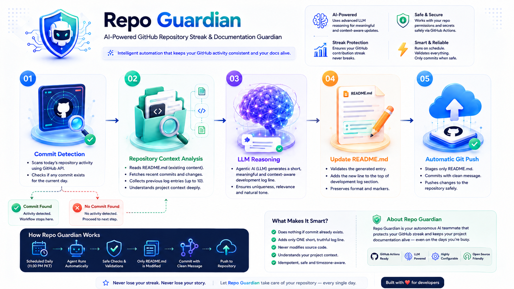

# 🛡️ Repo Guardian

> [!NOTE]
> Ever forgot to push your code and lost your GitHub streak? **Repo Guardian** is your friendly backup helper! 
> It automatically runs every night before midnight (around 11:00 PM - 11:30 PM Pakistan time) to protect your streak.

---

## 📊 How It Works (Step-by-Step Flow)

```
Every night before midnight (Pakistan Time)
                 │
                 ▼
     Did you push code today?
        ├── Yes ──► 😎 Stop. (Nothing to do!)
        └── No   ──► 🔍 Read README & recent commits
                             │
                             ▼
                 💡 Ask Groq AI for one sentence
                             │
                             ▼
                 📝 Add sentence to README log
                             │
                             ▼
                 🚀 Commit & Push README only
```

---

## 🎨 Workflow Diagram
Below is the diagram showing the Agentic AI workflow (nodes, edges, and graphs):




## ⚠️ Important Rules & Limitations

> [!IMPORTANT]
> **This is a backup tool, not a cheat tool.** It only writes humble, real sentences about your project files. It will never tell lies about work you did not do.

| Rule | Detail |
| :--- | :--- |
| **One Repo Only** | It only protects the repository you put it in. |
| **No Code Touched** | It only updates `README.md`. It never touches your Python/JS/HTML files. |
| **One Commit a Day** | It will never do more than one automated backup commit per day. |
| **Automatic Stop** | If you already pushed code today, it stops and does nothing. |

---

## 🌟 Quick Start (You only need to do this ONE TIME!)

Follow these simple steps to set up Repo Guardian. Once set up, it works automatically forever!

### Step 1: Get a free Groq Key
1. Go to [https://console.groq.com/keys](https://console.groq.com/keys).
2. Sign up or log in.
3. Click **Create API key**.
4. Copy the key (starts with `gsk_...`) and save it in a safe place.

### Step 2: Copy project files
Copy all the files of this project into the main folder of your repository.
> [!WARNING]
> Make sure the file `.github/workflows/streak-backup.yml` stays in that exact folder, or the timer won't start!

### Step 3: Setup on your computer
Open your terminal (Command Prompt or PowerShell) and run:

1. **Go to your folder:**
   ```bash
   cd your-repository-name
   ```
2. **Turn on the Python box (Virtual Environment):**
   * *Windows CMD:* `python -m venv venv` and `venv\Scripts\activate`
   * *Windows PowerShell:* `python -m venv venv` and `.\venv\Scripts\Activate.ps1`
   * *Linux / macOS:* `python3 -m venv venv` and `source venv/bin/activate`
3. **Install the libraries:**
   ```bash
   pip install -r requirements.txt
   ```
4. **Create your settings file:**
   * *Windows:* `copy .env.example .env`
   * *Linux/macOS:* `cp .env.example .env`
5. Open `.env` in Notepad and add your `GROQ_API_KEY`, name, and GitHub email.

> [!TIP]
> Find your GitHub email in **Settings → Emails**. If you use a private email, copy the address ending with `@users.noreply.github.com`.

---

## 🧪 Step 4: Test it locally
Check if the tool works by running:
```bash
python run_agent.py --dry-run
```
It will check your commits. Since you already committed today, it will print:
`[OK] Genuine commit already exists — nothing to do.`

---

## ☁️ Step 5: Setup on GitHub (The Cloud)

### 5a: Allow GitHub to write to your Repo
1. Open your repository on GitHub.
2. Click **Settings** at the top.
3. In the left menu, click **Actions** -> **General**.
4. Scroll down to **Workflow permissions**.
5. Select **Read and write permissions** and click **Save**.

### 5b: Add your Groq Secret key
1. Click **Settings** -> **Secrets and variables** -> **Actions** on GitHub.
2. Click **New repository secret**.
3. Name: `GROQ_API_KEY`
4. Value: Paste your key (`gsk_...`).
5. Click **Add secret**.

### 5c: Add your variables
In **Settings -> Secrets and variables -> Actions -> Variables**, click **New repository variable** to add these three:

| Variable Name | Value |
|---|---|
| `GIT_AUTHOR_NAME` | Your name |
| `GIT_AUTHOR_EMAIL` | Your GitHub email |
| `GROQ_MODEL` | `llama-3.3-70b-versatile` |

---

## 📤 Step 6: Push to GitHub

Send the files to your GitHub repository:
```bash
git add .
git commit -m "feat: add Repo Guardian"
git push origin main
```

---

## ⚡ Step 7: Run manual test on GitHub
1. Go to the **Actions** tab on your GitHub repository page.
2. Click **Repo Guardian** on the left list.
3. Click the **Run workflow** dropdown on the right side and click the green button.
4. Watch it turn green!

---

## 📂 Project Files
* `run_agent.py` — The script you run on your computer.
* `requirements.txt` — The list of libraries needed.
* `.env.example` — Configuration template.
* `src/` — Folder containing the Python files.
* `assets/` — Folder to place your workflow diagram image (e.g. `image1.png`).

---

**Author:** Haseeb ur Rehman

---

## Automated Development Log

<!-- STREAK_AGENT_LOG_START -->
- 2026-07-17: Project organization is proceeding as planned.
- 2026-07-16: Project organization is continuing steadily.
- 2026-07-15: Project organization is underway.

<!-- STREAK_AGENT_LOG_END -->
